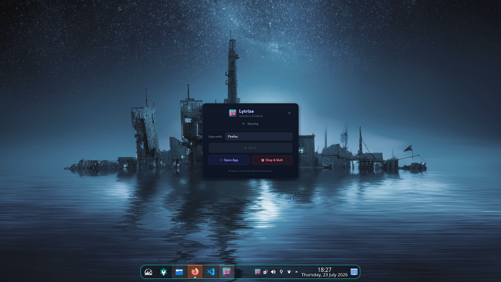
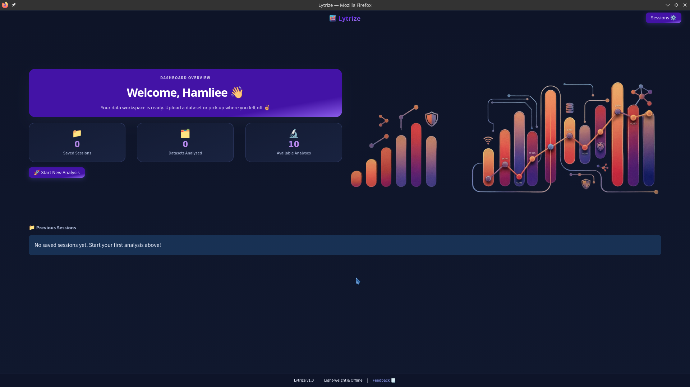
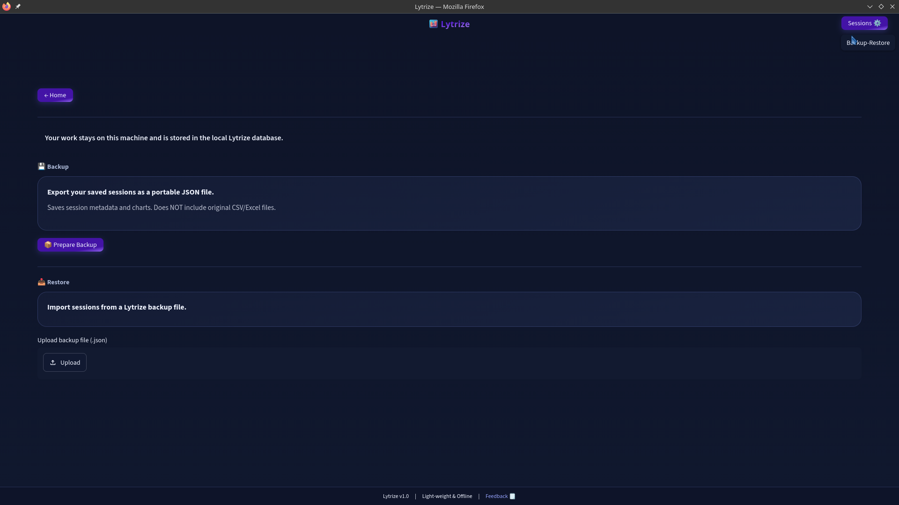
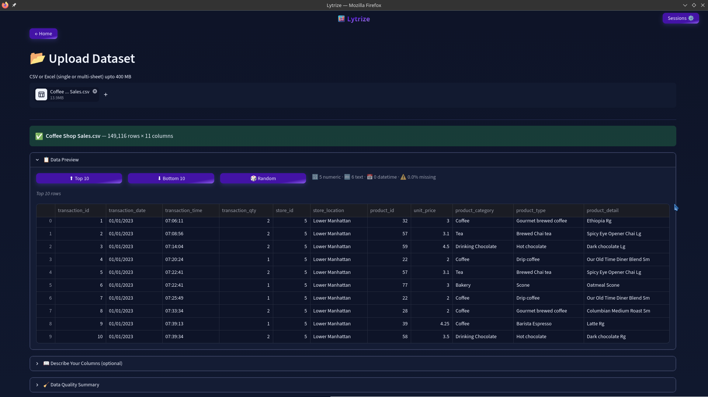
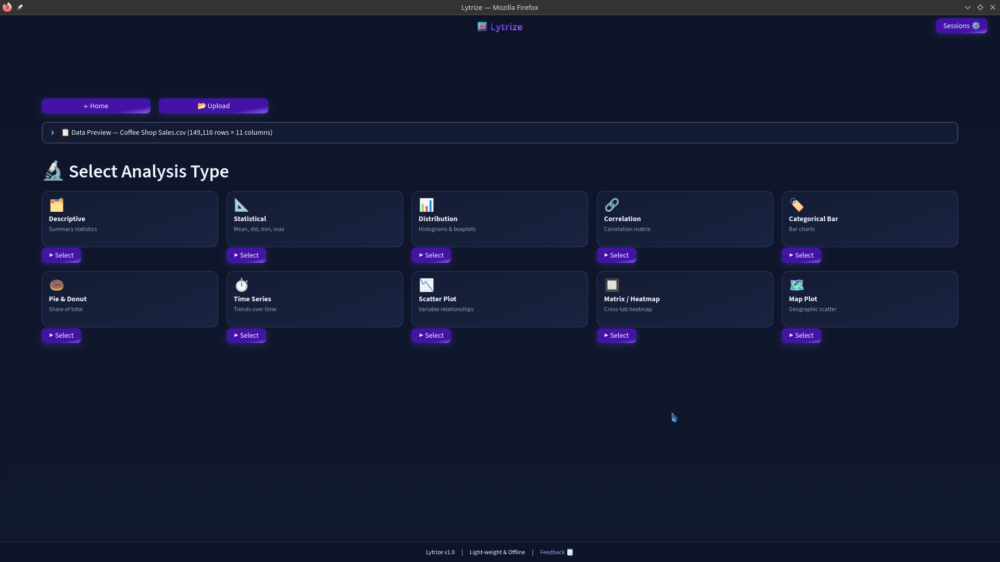
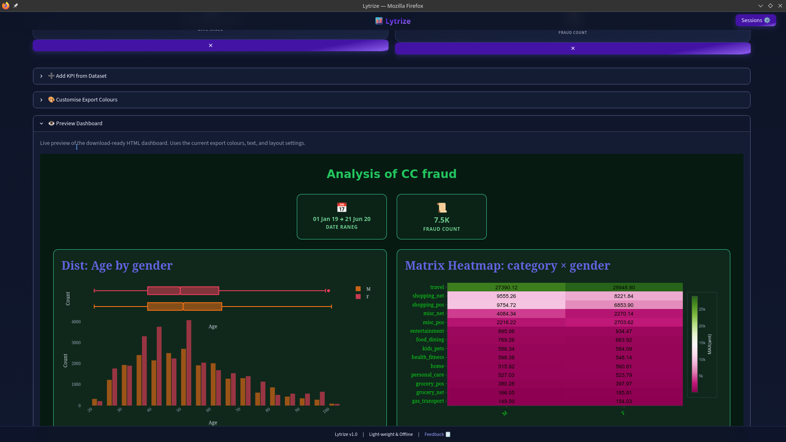

<div align="center">

# Lytrize Desktop

**Local-first data analytics for Linux & Windows - no cloud, no account, no setup.**

Upload a CSV or Excel file and get interactive charts and dashboards in seconds. Everything stays on your device.

[-blue?style=flat-square)](https://github.com/Kazake95/lytrize_desktop)
[-0078d4?style=flat-square)](https://github.com/Kazake95/lytrize_desktop)
[](https://python.org)
[](./LICENSE)

</div>

<div align="center">


**[📥 Download Desktop App](https://github.com/Kazake95/lytrize_desktop/releases)**

</div>

---

## Screenshots

| Start Up | Home Screen | Backup/Restore |
|---|---|---|
|  |  |  |

| Upload | Analysis | Dashboard building |
|---|---|---|
|  |  | 

---

## Quick Start

1. **Install** — grab the `.deb` / `.rpm` (**Linux**) or the `.exe` (**Windows**) from the [releases page](https://github.com/Kazake95/lytrize_desktop/releases).
   - *Linux*: install with `dpkg -i` or `dnf install`.
   - *Windows*: double-click the installer (admin prompt appears) — it installs to `Program Files\Lytrize`.
2. **Open** — launch `lytrize` (Linux) or **Lytrize** from the Start Menu / desktop shortcut (Windows). The launcher window appears while the backend starts, then your chosen browser opens automatically in an isolated window.
3. **Upload** — click **Start New Analysis** on the home screen and choose a CSV or Excel file (up to 400 MB).
4. **Analyze** — on the Analysis page, click any chart-type card (bar, time series, scatter, correlation, etc.), choose your columns and click **Generate**. Charts appear instantly.
5. **Build & Export** — click **Proceed to Dashboard**, arrange your charts in a grid, add KPI cards, then **Download HTML** to get a standalone file you can open in any browser or save as PNG via DevTools.

---

## Highlights

| | |
|---|---|
| **📊 11 chart types** | Bar, pie/donut, scatter, histogram, time series, correlation, pivot table, matrix heatmap, geographic map, outlier and data quality |
| **🗂️ Dashboard builder** | Arrange charts in a portrait (2-column) or landscape (3-column) grid, add KPI summary cards, set a title |
| **📤 Export** | Download as a self-contained HTML file — then use your browser's DevTools to save as PNG |
| **🧹 Data tools** | Rename columns, add calculated columns, change data types, flag outliers and handle missing values before analysis |
| **🔄 Auto-update** | Re-upload updated datasets and automatically regenerate all charts and KPIs — column renames and calculated columns are preserved |
| **💾 Session backup & restore** | Save local session backups and restore any compatible JSON backup, including ones shared by other users |
| **🔒 Fully offline** | No telemetry, no analytics, no outbound network requests |
| **🚀 Fast** | Chunked CSV reader, dtype optimization and smart sampling handle files up to 400 MB |

---

## What is Lytrize?

Lytrize is a desktop analytics app that runs entirely on your computer. Drop in a spreadsheet and get charts, statistics and a shareable dashboard. No internet connection needed, no sign-up, no data ever leaving your machine.

Built for people who work with data often and want answers fast — without opening a browser tab, logging into a service or waiting for a cloud query to finish.

### Desktop Launcher

Lytrize includes a native desktop launcher (PySide6) that manages the backend and opens the app in an isolated browser window. The launcher provides:

- **Browser selection** — choose Chrome, Chromium, Firefox, Brave, Edge, Vivaldi, Opera or your default browser
- **Isolated profiles** — Chromium-based browsers launch in app mode (`--app=`) with a separate profile; Firefox gets a clean isolated profile with `--kiosk`
- **System tray integration** — the app lives in the tray while running
- **Crash recovery** — if the backend crashes, the launcher shows a recoverable error instead of going blank
- **Progress indicator** — animated status dot and progress bar during startup

---

## System Requirements

| Requirement | Minimum | Recommended |
|---|---|---|
| **OS** | Linux (Ubuntu 20.04 LTS or later; Debian-based or RPM-based) or Windows 10/11 (64-bit) | Ubuntu 22.04 LTS or later, or Windows 11 |
| **Architecture** | amd64 / x64 (64-bit) | amd64 / x64 (64-bit) |
| **Python** | 3.11+ (only for building from source) | 3.11+ |
| **Browser** | Any installed browser — Chrome, Chromium, Firefox, Brave or Edge | Chromium-based (best experience) |
| **Disk** | ~1.3 GB installed (1.1 GB app + 147 MB user data) | ~1.3 GB |
| **RAM** | 6 GB minimum | 8 GB+ for files over 100 MB |

---

## Install

### Option 1 — Debian / Ubuntu (.deb)

```bash
sudo dpkg -i lytrize_1.2_amd64.deb
```

If `dpkg` reports missing dependencies:

```bash
sudo apt-get install -f
```

Launch from your application menu or run:

```bash
lytrize
```

No manual Python setup, no `pip install`, no virtual environment to activate. The package bundles its own isolated Python virtual environment at `/opt/lytrize/venv/`.

### Option 2 — Fedora / RHEL / openSUSE (.rpm)

```bash
sudo dnf install lytrize-1.2-1.x86_64.rpm
# or on older systems:
sudo rpm -i lytrize-1.2-1.x86_64.rpm
```

### Option 3 — Windows (.exe)

```text
LytrizeSetup_1.2.exe
```

Double-click the installer. A Windows Defender SmartScreen warning may appear on some systems — click **More info** → **Run anyway** if you downloaded it from the official releases page.

> **Note:** The installer requires **administrator privileges** (a UAC prompt will appear). Installs to `Program Files\Lytrize` (64-bit Windows only). The installer bundles its own Python virtual environment, so there is no separate Python setup.

Launch **Lytrize** from the Start Menu or desktop shortcut. User data is written to `%APPDATA%\Lytrize` and `%LOCALAPPDATA%\Lytrize`.

> **Windows tip:** If your antivirus software flags the installer (false positive), add an exclusion for the `Program Files\Lytrize` folder after installation. See [Troubleshooting](#troubleshooting) below.

### Option 4 — Build from source

See [CONTRIBUTOR.md](./CONTRIBUTOR.md#development-setup) for the full developer setup.

---

## How to Use Lytrize

### 1. Open the app
- **Linux:** Launch Lytrize from your application menu or run `lytrize` in a terminal.
- **Windows:** Launch **Lytrize** from the Start Menu or desktop shortcut.

A launcher window appears while the Streamlit backend starts, then your browser opens automatically in an isolated window.

### 2. Upload a file
Click **Start New Analysis** on the home screen and choose a CSV or Excel file. Lytrize shows a preview and lets you rename columns, add calculated columns, fix data types and flag outliers before proceeding.

### 3. Run an analysis
On the Analysis page, click any chart-type card — bar chart, time series, scatter plot, correlation heatmap and so on. Choose your columns and options, then click **Generate**. Charts appear right away.

### 4. Build a dashboard
Charts you generate collect in your session. Click **Proceed to Dashboard** to arrange them, add KPI summary cards, set a title and pick a portrait (2-column) or landscape (3-column) layout.

### 5. Save, back up and export
Your session saves automatically as you work. Use **Save Session** to make a named checkpoint you can see on the home screen. Use **Restore Backup** to import any compatible JSON backup from another user or from your own archive. Use **Download HTML** to get a standalone file you can open in any browser or share with someone else. Save the HTML page as PNG using your browser's DevTools screenshot tool.

### 6. Update your data
If you need to update your dataset, go to the Home page, click **Edit** on a saved session and re-upload the modified file. Lytrize automatically reapplies your column renames and calculated columns, then regenerates all charts and KPIs with the new data.

---
## Lytrize-Clip Chromium Extension

**[📥 Click to Download Lytrize-Clip ](https://github.com/Kazake95/lytrize_desktop/releases/tag/Lytrize_Clip_Chromium_Extension)**

**Lytrize-Clip** captures full-page screenshots of rendered web pages and local HTML files as a single PNG — without scrolling, zooming or viewport stitching.

It uses the Chrome DevTools Protocol (`Page.captureScreenshot` with `captureBeyondViewport`) and saves the image through the browser's native download manager.

## Linux Installation

The release includes:

```text
Lytrize-Clip_installer.sh
Lytrize-Clip/
```

The installer copies the extension to the persistent location:

```text
~/Lytrize-Clip
```

So the original extracted release folder can be deleted after installation.

> **Important:** Close your Chromium-based browser before running the installer.

```bash
chmod +x Lytrize-Clip_installer.sh
./Lytrize-Clip_installer.sh [browser-name]
```

Supported browsers:

```text
chrome  chromium  edge  brave  opera  vivaldi  auto
```

Example:

```bash
./Lytrize-Clip_installer.sh chromium
```

Restart the browser after installation and pin Lytrize-Clip for quick access.

> **Note:** Chromium may require **Developer mode** for unpacked extensions. If manual loading is required, select `~/Lytrize-Clip`, not the extracted release folder.

## Windows Installation

There's no installer script for Windows. Extract the release `.zip` to a persistent location, e.g. `%USERPROFILE%\Lytrize-Clip`, close your Chromium-based browser, then follow the **Manual Installation** steps below, selecting that folder.

## Manual Installation

1. Open your Chromium browser's extensions page.
2. Enable **Developer mode**.
3. Select **Load unpacked**.
4. Choose the persistent `Lytrize-Clip` folder.

## Permissions

- `debugger` — Chrome DevTools Protocol full-page capture
- `activeTab` — access to the active tab
- `downloads` — save screenshots as PNG

Lytrize-Clip does not collect, transmit or store captured page data.

---

## Chart Types

| Chart | What it does |
|---|---|
| **Descriptive** | Full summary statistics table (count, mean, std, min, max, quartiles) |
| **Statistical** | Mean, median, min, max, std for numeric columns grouped by a category |
| **Distribution** | Histograms and boxplots for numeric columns |
| **Correlation** | Correlation matrix heatmap across numeric columns |
| **Categorical Bar** | Bar/column charts from categorical dimensions and numeric metrics |
| **Pie & Donut** | Share-of-total charts with sorting and top-N filtering |
| **Time Series** | Trends over time with date grouping (year, month, day, hour) and aggregation |
| **Scatter Plot** | Variable relationships with optional trendlines (OLS or LOWESS) |
| **Matrix Heatmap** | Cross-tabulation heatmap (pivot table as a heatmap) |
| **Pivot Table** | Cross-tabulation table (pivot table as a data table) |
| **Map Plot** | Geographic scatter (lat/lon) or choropleth (country/region names) |
| **Outlier** | IQR-based outlier detection across numeric columns |
| **Data Quality** | Missing values, duplicate rows and column quality summary |

---

## Where is My Data Stored?

Everything lives on your machine:

| What | Linux | Windows |
|---|---|---|
| Sessions, charts, KPIs, dashboard layouts | `~/.local/share/lytrize/lytrize.db` (SQLite) | `%APPDATA%\Lytrize\lytrize.db` |
| Active DataFrame (in-session) | `$XDG_RUNTIME_DIR/lytrize/df_<id>.parquet`, falls back to `~/.cache/lytrize/` | `%LOCALAPPDATA%\Lytrize\df_<id>.parquet` |
| Launcher preferences (browser choice) | `~/.local/share/lytrize/launcher_prefs.json` | `%APPDATA%\Lytrize\launcher_prefs.json` |
| Browser profiles (isolated) | `~/.local/share/lytrize/browser-profiles/` | `%APPDATA%\Lytrize\browser-profiles\` |
| Backend log | Streamlit writes to `~/.local/share/lytrize/streamlit.log` | `%APPDATA%\Lytrize\streamlit.log` |

The parquet snapshot is used to restore your loaded dataset after a browser tab refresh. It is not kept across reboots if stored on tmpfs — if the app restarts after a reboot and your file is gone, you will be asked to re-upload.

---

## Uninstall

**Linux**

```bash
sudo dpkg -r lytrize          # Debian / Ubuntu
sudo dnf remove lytrize       # Fedora / RHEL
```

**Windows** — Settings → Apps → *Lytrize* → Uninstall (or run `unins000.exe` from `Program Files\Lytrize`).

> **⚠️ Warning:** On **both** platforms the uninstaller **removes all user data** — including saved sessions, dashboards and the local database (Linux: `~/.local/share/lytrize/`; Windows: `%APPDATA%\Lytrize` and `%LOCALAPPDATA%\Lytrize`). Any running Lytrize launcher / backend processes are force-closed first. Back up your sessions first (Home → **Restore Backup** → **Backup**) if you want to keep them.

---

## Troubleshooting

**The app does not start (Linux)**
Run `lytrize` from a terminal to see live output. Check the terminal for Python tracebacks. The backend log is also written to `~/.local/share/lytrize/streamlit.log`.

**The app does not start (Windows)**
Launch **Lytrize** from the Start Menu and check the launcher window for errors. The backend log is written to `%APPDATA%\Lytrize\streamlit.log`. If the app fails to start, try right-clicking the shortcut and selecting **Run as administrator**.

**Missing dependencies after install**
Run `sudo apt-get install -f` (Debian/Ubuntu) or `sudo dnf install -f` (Fedora/RHEL) then try again.

**Windows Defender SmartScreen warning**
If SmartScreen blocks the installer, click **More info** → **Run anyway**. This is a false positive — the installer is not signed with an EV certificate.

**Antivirus interference (Windows)**
Some antivirus programs may flag the installer or interfere with the build process. Add an exclusion for `Program Files\Lytrize` (installed app) or the `build` folder (during development). For Windows Defender (run as Administrator):
```powershell
Add-MpPreference -ExclusionPath "C:\Program Files\Lytrize"
```

**Downloading as PNG / image**
The app exports a standalone HTML file. To save that page as a PNG, use your browser's built-in screenshot tools:

- **Chrome/Edge/Opera/Brave:** Open DevTools (`Ctrl+Shift+I`), then `Ctrl+Shift+P`, type "screenshot", choose **Capture full size screenshot**
- **Firefox/LibreWolf:** `Ctrl+Shift+S` (or right-click → *Take Screenshot*)

**The browser does not open automatically**
If no supported browser is detected, copy `http://127.0.0.1:8501` into any browser while the launcher window shows "Running".

**Large files are slow**
Lytrize uses smart sampling for scatter plots (8,000 points) and maps (5,000 points), plus chunked reading for CSVs over 30 MB. For best performance with files over 100 MB, use 8 GB+ RAM.

**Something looks broken**
- **Linux:** Check the terminal output for Python tracebacks. If the issue happens again, open an issue and attach the log at `~/.local/share/lytrize/streamlit.log`.
- **Windows:** Check the backend log at `%APPDATA%\Lytrize\streamlit.log`. If the issue happens again, open an issue and attach the log.

**Database corruption**
If the app fails to start with a SQLite error, your database may be corrupt. Close the app completely, then:

*Linux:*
```bash
rm ~/.local/share/lytrize/lytrize.db
```

*Windows:*
```powershell
Remove-Item "$env:APPDATA\Lytrize\lytrize.db"
```

Restart the app — a fresh database will be created automatically. Your saved sessions will be lost (use **Restore Backup** to recover from a JSON backup if you have one).

---
## Upcoming development plan

**1. Light mode theme**

**2. Dynamic filter/slicer per chart**

**3. UI improvements & minor bug fixes**

---

## Contributing

Lytrize is open source. Bug reports, feature requests and pull requests are welcome.

Before opening a PR, please read [CONTRIBUTOR.md](./CONTRIBUTOR.md) for the full development setup, architecture overview and contribution guidelines.

---

## License

MIT — see [LICENSE](./LICENSE) for the full text.
